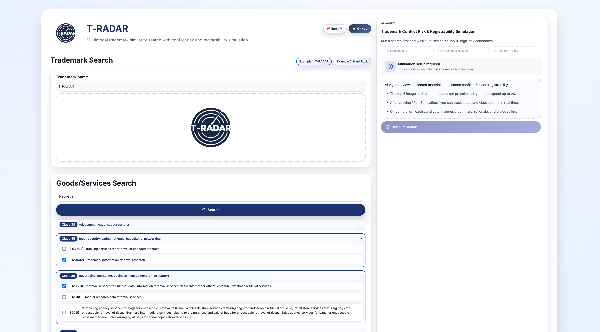
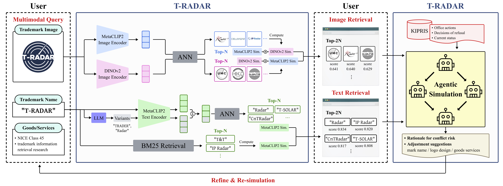
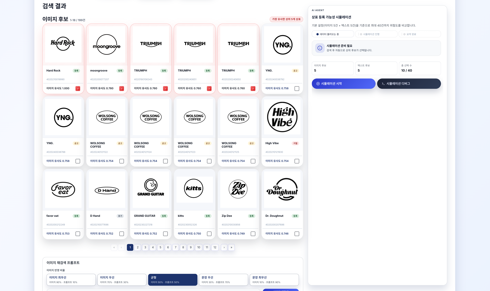
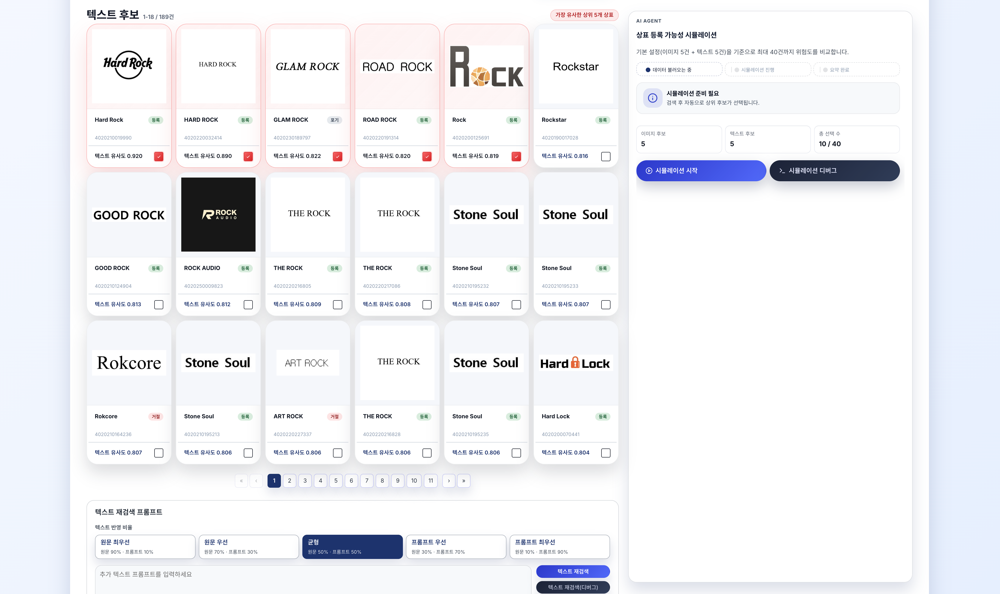
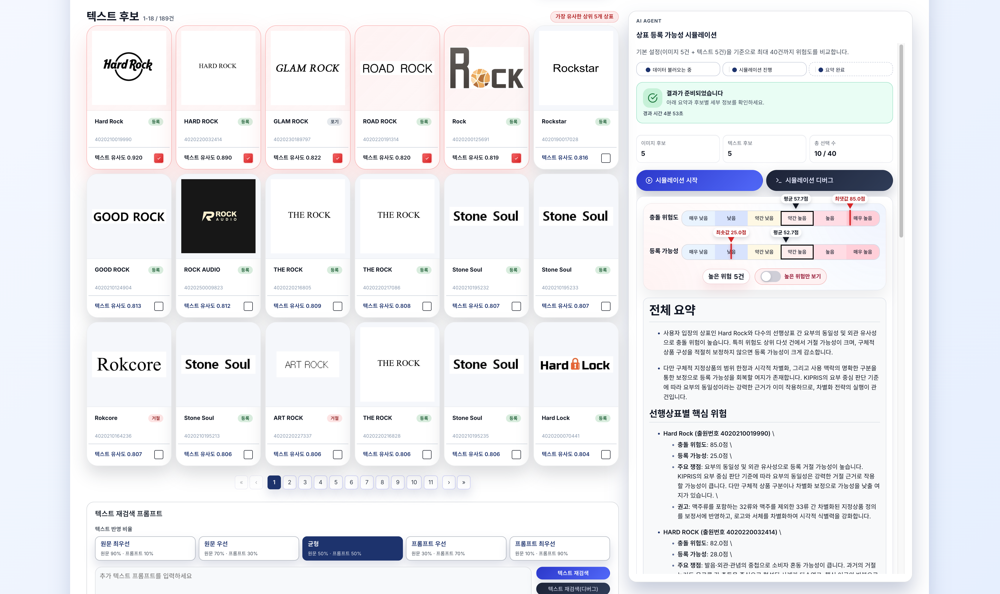
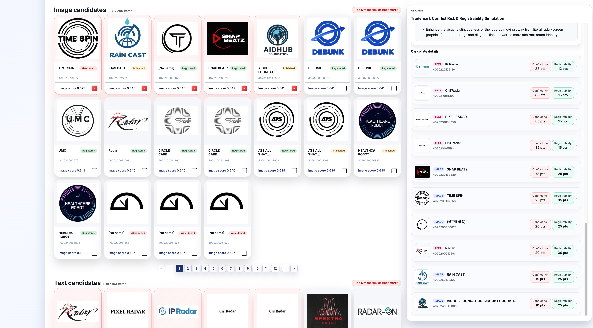

# T-RADAR: 상표 충돌 위험 평가를 위한 인터랙티브 검색 인터페이스 기반 상표 심사 시뮬레이션

> **저자**: Yongdeuk Seo, Noah Lee, Hyun-seok Min, Sungchul Choi

[](https://yongchoooon.github.io/tradar/) [](https://do7ajfzdgr22.cloudfront.net/)

## 🎉 축하합니다!
이 레포지토리는 ACM SIGIR 2026 Demonstration Track에 채택된 논문의 공식 구현입니다: [링크](https://sigir2026.org/en-AU/pages/program/accepted-papers#:~:text=%5Bde%5D%20T%2DRADAR%3A%20Simulating%20Trademark%20Examination%20as%20an%20Interactive%20Retrieval%20Interface%20for%20Conflict%20Risk%20Assessment)

---
T-RADAR는 멀티모달 검색과 프로토콜 기반 심사 시뮬레이션을 결합한 인터랙티브 상표 클리어런스 시스템입니다.



## 개요
- **하이브리드 멀티모달 검색**으로 후보를 탐색합니다(로고 이미지 + 상표명 + 상품/서비스).
- **에이전트 기반 시뮬레이션**으로 심사관-출원인 간 교환을 모델링하고, 충돌 위험도와 등록 가능성 점수를 산출합니다.
- **인터랙티브 개선 루프**를 통해 사용자가 상표명이나 상품 범위를 조정했을 때 전후 결과를 비교할 수 있습니다.
- **근거 기반 판단**을 위해 가능한 경우 KIPRIS 의견제출통지서와 거절결정서를 활용합니다.

## 워크플로우 (데모)
1. **질의**: 상표(텍스트, 이미지 또는 둘 다)와 상품/서비스를 입력해 후보를 검색합니다.
2. **선택 및 시뮬레이션**: 후보 쌍을 선택하고 구조화된 심사 시뮬레이션을 실행합니다.
3. **개선 및 재시뮬레이션**: 입력을 조정한 뒤 다시 실행해 결과를 나란히 비교합니다.

## 시스템 파이프라인


## 핵심 방법

### 검색
T-RADAR는 BM25 키워드 검색과 임베딩 기반 ANN 검색을 결합합니다. 이미지 질의에는 DINOv2와 MetaCLIP2 임베딩을 융합하고, 텍스트 질의에는 BM25 후보를 MetaCLIP2 텍스트 유사도로 재정렬합니다. 선택적으로, 가벼운 LLM 기반 명칭 변형 생성을 사용해 재정렬 전에 재현율을 넓힐 수 있습니다.

### 시뮬레이션
선택된 각 쌍은 고정된 심사 프로토콜을 따릅니다. Examiner가 거절 이유를 제기하고, Applicant가 반박하며, Examiner가 판단을 내린 뒤, Reporter가 요약하고 Scorer가 충돌 위험도와 등록 가능성 점수를 부여합니다. Final Reporter는 여러 쌍의 결과를 종합하고 고위험 사례를 강조합니다. 출력은 완료되는 대로 UI에 스트리밍됩니다.

## UI
- 단일 화면 레이아웃에서 페이지를 벗어나지 않고 검색과 시뮬레이션이 연결됩니다.
- 후보는 유사도 점수와 상품/서비스 맥락을 포함한 간결한 카드로 표시됩니다.
- 시뮬레이션 결과는 후보 쌍별 리포트와 검토 우선순위 지정을 위한 종합 배치 요약을 제공합니다.

<table>
  <tr>
    <td align="center">
      
      <br>
      <sub>이미지 검색 결과</sub>
    </td>
    <td align="center">
      
      <br>
      <sub>텍스트 검색 결과</sub>
    </td>
  </tr>
  <tr>
    <td align="center">
      
      <br>
      <sub>시뮬레이션 결과</sub>
    </td>
    <td align="center">
      
      <br>
      <sub>시뮬레이션 점수</sub>
    </td>
  </tr>
</table>

## 배포 (참고)
- **프런트엔드**: S3 + CloudFront 기반 정적 빌드.
- **백엔드**: ALB 뒤의 ECS/Fargate API.
- **검색 오프로딩**: 데스크톱 GPU 워커가 로컬 Postgres/pgvector와 OpenSearch에 연결되며, 백엔드는 WebSocket으로 워커와 통신합니다.
- **선택적 클라우드 검색**: 검색 스택은 RDS와 OpenSearch Service로 이전할 수 있습니다.

## 재현성
이 공개 레포지토리에는 T-RADAR의 애플리케이션 코드, UI 자산, 배포 정의가 포함되어 있습니다. 다만 운영 시스템을 처음부터 끝까지 재현하는 데 필요한 모든 요소를 포함하지는 않습니다.

배포된 시스템은 다음 요소에 의존합니다:
- [KIPRIS Plus](https://plus.kipris.or.kr/portal/main.do)에서 라이선스를 받은 독점 상표 코퍼스,
- 사전 구축된 PostgreSQL/pgvector 및 OpenSearch 인덱스,
- AWS 인프라, 시크릿, 배포 설정,
- 검색 오프로딩에 사용되는 데스크톱 GPU 워커.

법적, 라이선스, 운영상의 이유로 운영 데이터, 검색 인덱스, 시크릿은 이 레포지토리에서 재배포하지 않습니다. 따라서 이 레포지토리만으로는 전체 운영 환경을 완전히 재현할 수 없습니다.

## 실행 가능한 범위
프로젝트의 일부는 로컬에서 확인하고 실행할 수 있습니다:

```bash
pip install -r requirements.txt
pytest

cd frontend
npm ci
npm run build
```

자체 데이터와 인프라에 맞춰 시스템을 조정하려면 다음 문서를 구현 참고 자료로 사용하세요:
- `README_dev.md`
- `markdown/tradar_setup_guide.md`
- `markdown/search-pipeline.md`

## 데이터 공개 범위
운영용 상표 코퍼스는 이 레포지토리에 포함되어 있지 않습니다. 데이터 일부는 유료 [KIPRIS Plus](https://plus.kipris.or.kr/portal/main.do) 라이선스를 통해 확보되었으며, 여기에서 공개 공유하거나 재배포할 수 없습니다. 이 레포지토리에는 `app/data/goods_services/` 아래의 상품/서비스 보조 파일처럼 직접 배포 가능한 자료만 포함됩니다.

## 라이선스
함께 제공되는 ACM SIGIR Demo 논문은 CC BY 4.0으로 출판될 예정입니다. 해당 출판 라이선스가 이 레포지토리의 코드, 자산 또는 데이터에 자동으로 적용되는 것은 아닙니다. 레포지토리 차원의 권리는 별도 `LICENSE`에 정의되어 있으며, 제3자 또는 독점 데이터셋은 각자의 조건을 따릅니다.
